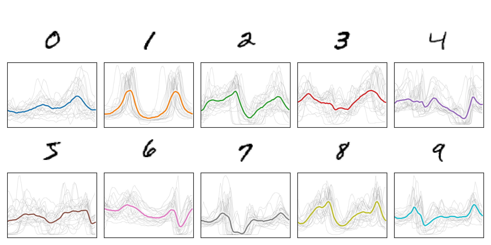

An experiment classifying MNIST digits in 1D with polar aggregation.

See the [blog post](http://aazuspan.dev/blog/classifying-mnist-as-1d-signals/) for details.

## Method

1. Digit images are converted to 1D signals by aggregating over the radial dimension in polar space.

  https://github.com/user-attachments/assets/6833013f-0c52-4c75-9b5a-0e4b607e8280

1. Signals are classified using a [1D CNN](https://github.com/aazuspan/mnist-polar/blob/main/src/polar_mnist/model.py).

